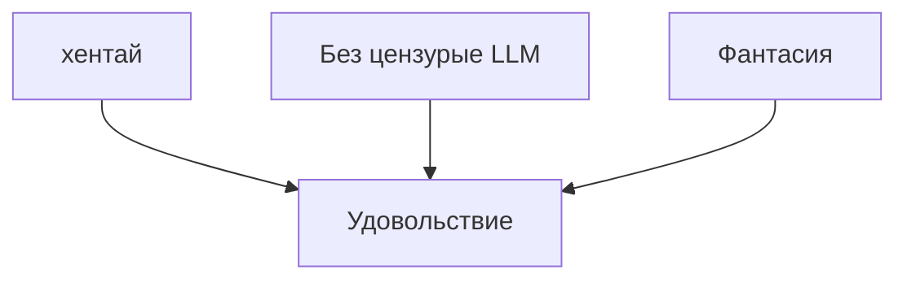

---

## Статистика

<div align="center">
  
  
</div>

<div align="center">
  
</div>


<div align="center">
  
</div>

<div align="center">
  
  
</div>

<br>

---

<br>
## О себе

```markdown
🔭 Пока любитель, учусь на программиста в УрФУ
🌱 Основной язык: Python
💻 Изучаю: Python, FastAPI, LLM
📫 Почта: zma20060@gmail.com
```



```mermaid
graph TB
    A[хентай] --> B[Fullstack<br/>AI Developer]
    C[Без цензурые LLM] --> B
    D[Фантасия] --> B
    B[Удовольствие]
    

```


